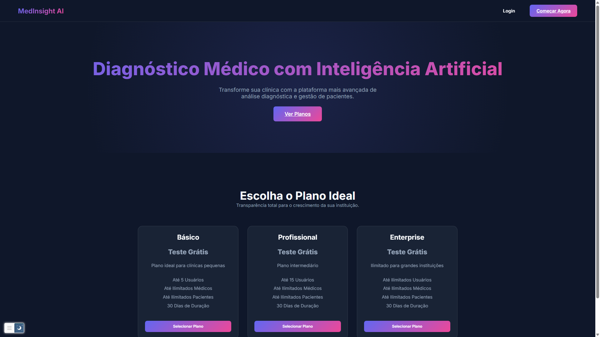
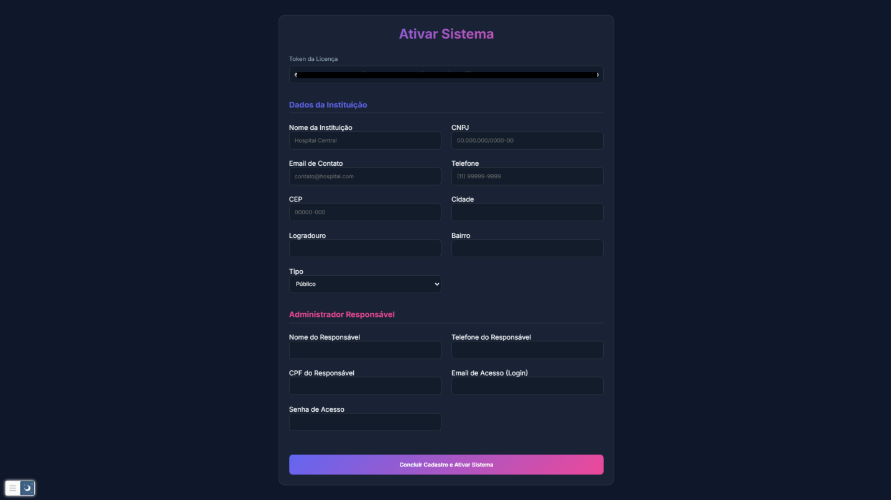
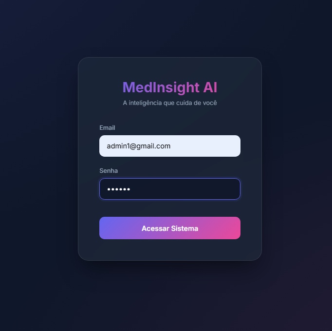
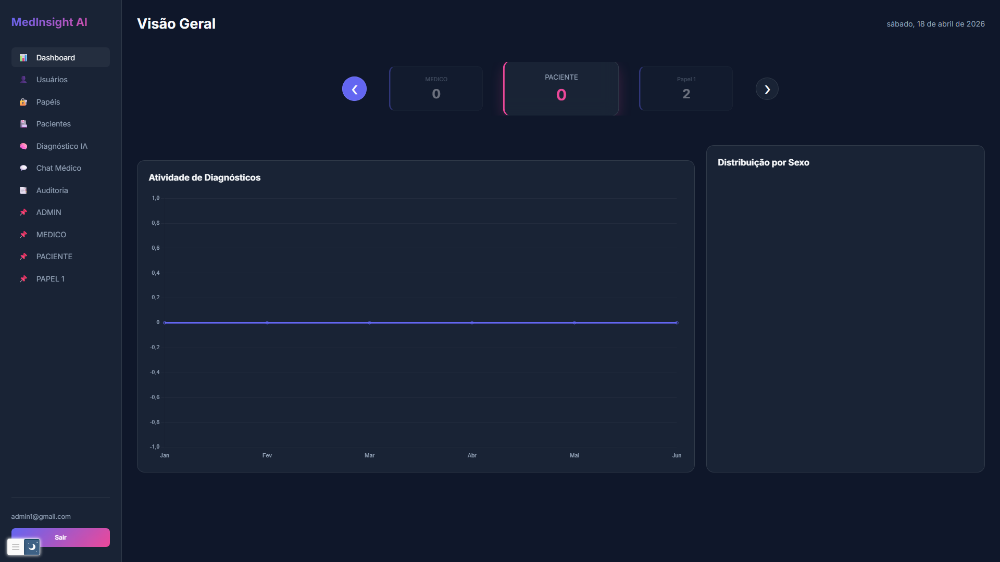
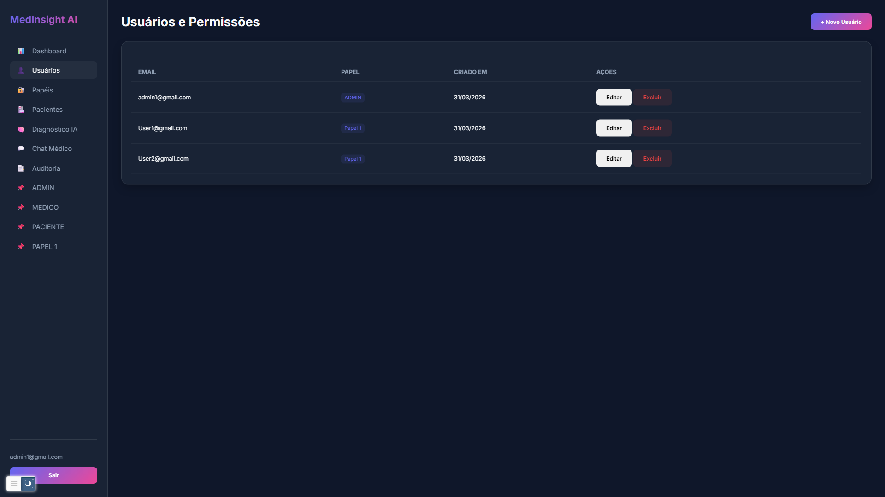
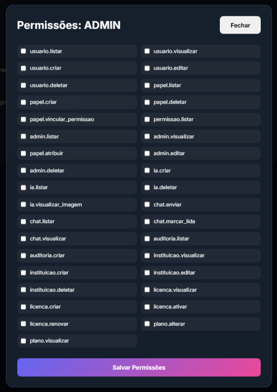
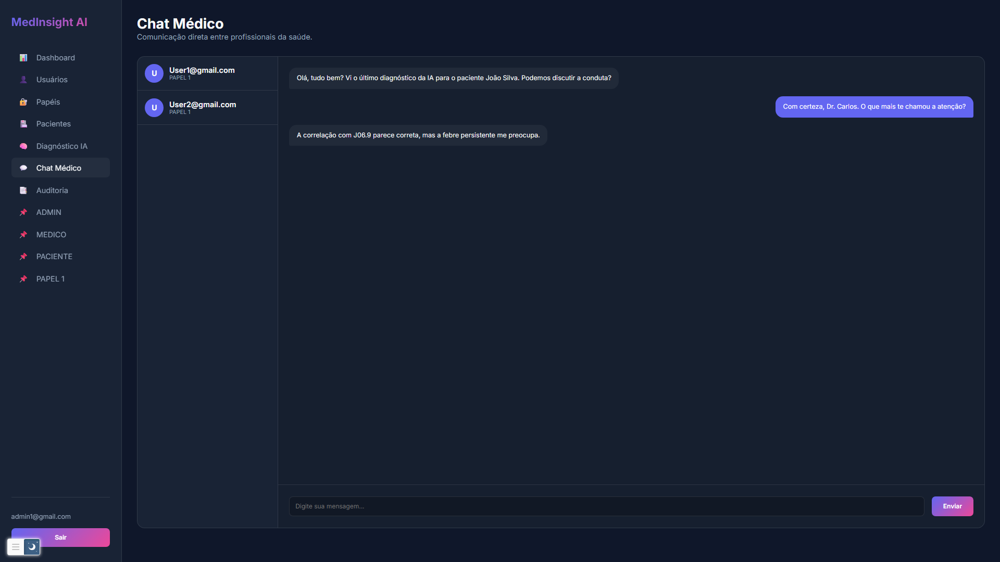
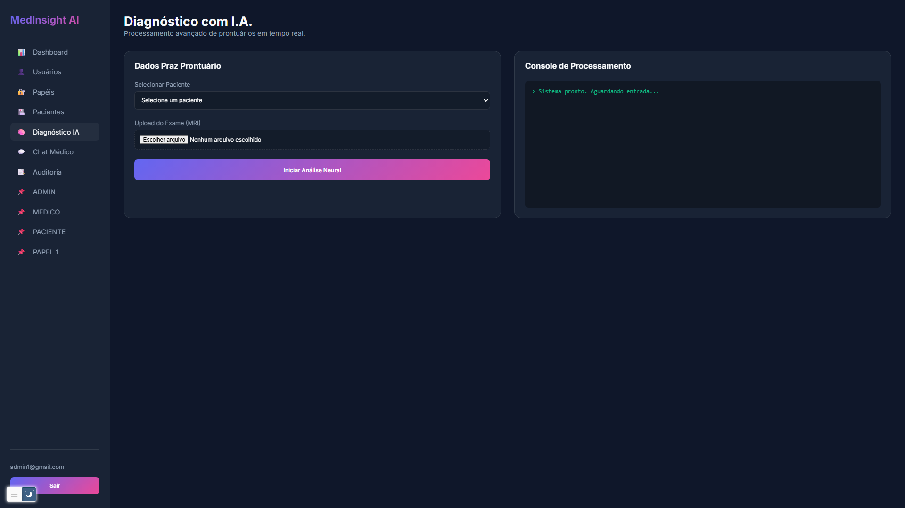

# VERSAO REFATORADA DO PROJETO - https://github.com/SamiLM4/TCC-2025

## Não apresenta integração com a IA, pois foi decidido que ela será desenvolvida em outro projeto, com um visual dedicado também.

Versão REFATORADA do projeto TCC, com melhorias em UI e UX.
Segue algumas interfaces.

# Tela inicial

# Adquirindo licença

# Tela de login

# Dashboard

# Abas do sistema

### Essa nova interface da IA não será desenvolvida, pois essa parte do sistema sera dedicada a um novo projeto.

